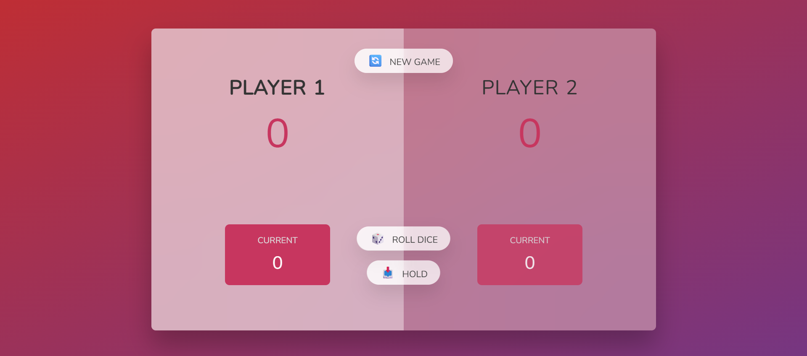
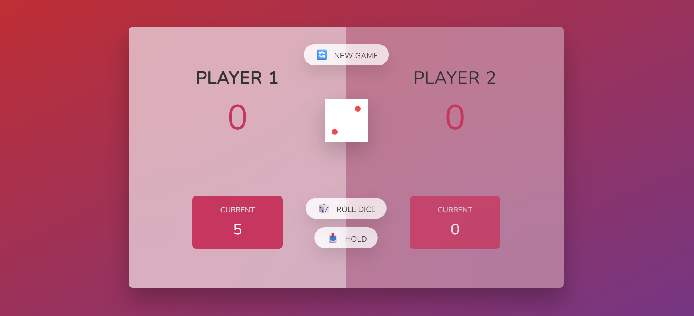
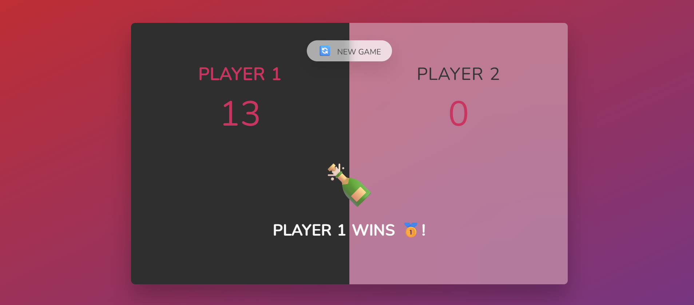

# 🎲 Pig Game

Welcome to the **Pig Game**, a fun and interactive dice game built with **HTML, CSS, and JavaScript**! Roll the dice, hold your score, and be the first player to reach the winning score.

---

## 🕹️ Game Rules

1. The game is played by **two players**.
2. Each turn, a player rolls a dice as many times as they like.
3. **If the player rolls a 1**, their current score for that turn is lost and the turn switches to the other player.
4. A player can **“Hold”** to add their current score to their total score and end their turn.
5. The first player to reach **100 points** (configurable in code) wins the game! 🎉

---

## 🎨 Features

* **Interactive Dice Roll**: Click a button to roll the dice and see the outcome instantly.
* **Hold Functionality**: Secure your current points before risking a 1.
* **Winning Animations**: Celebratory gold glow, emojis, and dynamic text when a player wins.
* **Responsive Design**: Looks great on desktop and mobile screens.
* **Restart Game**: Start a new game at any time with a single button click.

---

## ⚡ How to Play

1. Open `index.html` in your browser.
2. Roll the dice using the **Roll Dice** button.
3. Click **Hold** to add your points to your total score.
4. Repeat until a player wins.
5. Press **New Game** to restart anytime.

---

## 🛠️ Built With

* **HTML5** – For structure and layout.
* **CSS3** – For styling, animations, and glow effects.
* **JavaScript (ES6)** – For game logic, dice roll simulation, and dynamic UI.

---

## 🌟 Highlights

* Eye-catching **glow and emoji effects** for winner announcement.
* Smooth **score updates** and **active player toggling**.
* Clean and modular **JavaScript code**.
  
---

## 🖼️ Screenshots

### Game Start
  

### Rolling Dice
  

### Player Wins
  

---

## 🎉 Enjoy the Game!

Test your luck, have fun, and may the best player win! 🥇
